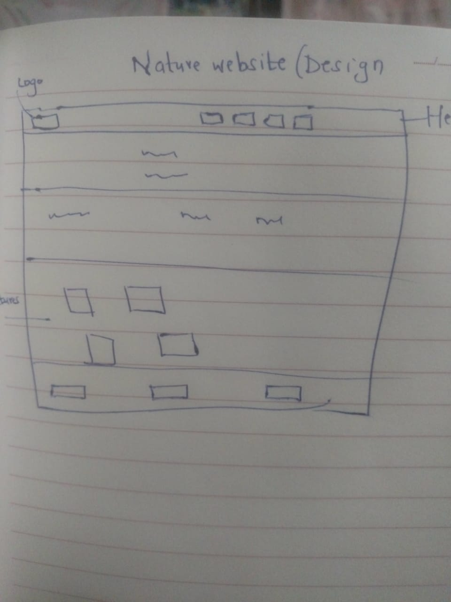

# my-webpage

The name of my website is Nature website.It is a photography website cointain nature shot pictures which speak volumes about how wonderful and spectacular the world around us is.
Dive into nature which this awesome website and escape from reality.

## The live link to my website
lizgi.github.io/my-webpage/

# website Design

###  language make up
use of *HTML* and *css* code.

#####  project set up instructions
favorite photographs

####   Tools used.
1. VS code
2. UBUNTU terminal for line commands
3. github account for creation and storage of work on cloud
4. creativity

#  Developer Name
*Elizabeth Gikonyo*
Github name:*lizgi*

##  License
 Website has MIT License.

 
